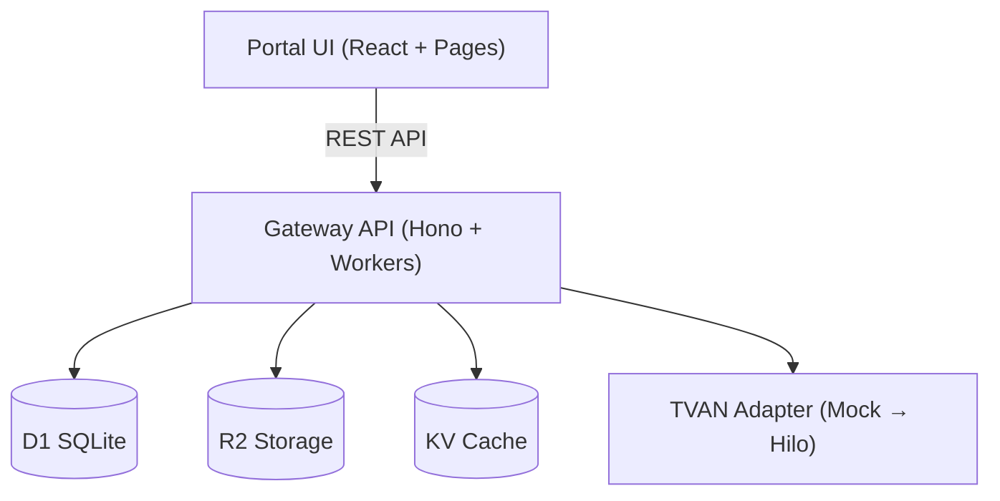

# Haravan Invoice MVP

> Hệ thống quản lý hóa đơn điện tử cho 80k+ merchant Haravan, xây dựng trên Cloudflare free tier với kiến trúc Gateway + Portal.

## 📋 Tóm tắt nhanh

| Thuộc tính | Giá trị |
|---|---|
| **Tên dự án** | haravan-invoice-mvp |
| **Phiên bản** | 0.2.0 |
| **Mục tiêu** | Quản lý HĐĐT cho 80k+ merchant |
| **Nền tảng** | Cloudflare Workers + Pages |
| **Tuân thủ** | NĐ 123/2020, NĐ 70/2025, TT 32/2025 |
| **Test coverage** | 98 tests passing / 14 files |

## 🏗️ Kiến trúc tổng quan



**3 lớp chính:**

- **Portal UI** — React SPA, 20+ screens trên Cloudflare Pages
- **Gateway API** — Hono framework, 25+ endpoints trên Cloudflare Workers
- **Data Layer** — D1 (SQLite), R2 (PDF), KV (session/cache)

## 🚀 Bắt đầu nhanh

```bash
# Cài đặt dependencies
pnpm install

# Setup database
cd apps/api && pnpm db:migrate && pnpm db:seed

# Chạy API (port 8787)
pnpm dev

# Chạy Portal (port 5173, terminal khác)
pnpm dev:portal
```

## 📚 Cấu trúc tài liệu

| Phần | Nội dung |
|---|---|
| [**Kiến trúc kỹ thuật**](./tech/architecture.md) | System design, database, data flow, deployment |
| [**Hướng dẫn sử dụng**](./sop/getting-started.md) | SOP từng tính năng cho merchant |
| [**Tài liệu API**](./api/overview.md) | Reference 25+ endpoints với ví dụ |
| [**Persona & JTBD**](./knowledge/personas.md) | Phân tích người dùng và nhu cầu |

## 🔧 Tech Stack

| Layer | Công nghệ |
|---|---|
| Frontend | React 18 + TypeScript + Vite → Cloudflare Pages |
| Backend | Hono → Cloudflare Workers |
| Database | D1 (SQLite edge) + Drizzle ORM |
| Storage | R2 (PDF cache) |
| Cache | KV (sessions, idempotency) |
| Auth | Mock JWT → Haravan SSO (tương lai) |
| Test | Vitest |

## 🔑 Tuân thủ pháp lý

- **NĐ 123/2020/NĐ-CP** — Khung tổng về hóa đơn điện tử
- **NĐ 70/2025/NĐ-CP** — Sửa 40/61 điều NĐ 123, HKD ≥1B bắt buộc máy tính tiền
- **TT 32/2025/TT-BTC** — Thay thế TT 78, hướng dẫn chi tiết
- **QĐ 1510/QĐ-TCT** — Format dữ liệu CQT

## 📊 Tính năng chính

| Tính năng | Trạng thái | Mô tả |
|---|---|---|
| Phát hành HĐ 1-click | ✅ | POS/Web/Admin, auto-issue khi paid |
| CRUD hóa đơn | ✅ | Tạo, xem, thay thế, điều chỉnh |
| Xử lý sai sót | ✅ | Wizard hướng dẫn điều chỉnh/thay thế |
| Báo cáo | ✅ | Quý, tháng, bán hàng, xóa/sửa/thay thế |
| Phân tích | ✅ | KPI, channel, top customer/SKU |
| Quản lý khách hàng | ✅ | List, detail, analytics |
| Quản lý sản phẩm | ✅ | Auto-extract từ invoice items |
| Gộp đơn lẻ cuối ngày | ✅ | Aggregate theo NĐ 70 |
| Compliance Center | ✅ | Audit trail, compliance tracking |
| Thông báo | ✅ | Real-time notifications |
| Cấu hình mẫu HĐ | ✅ | Mẫu số, ký hiệu |
| Tự động hóa | ✅ | Auto-issue, delay, notification rules |

## 🔗 Liên kết liên quan

- [Kiến trúc hệ thống](./tech/architecture.md)
- [Hướng dẫn bắt đầu](./sop/getting-started.md)
- [API Reference](./api/overview.md)
- [Database Schema](./tech/database.md)
