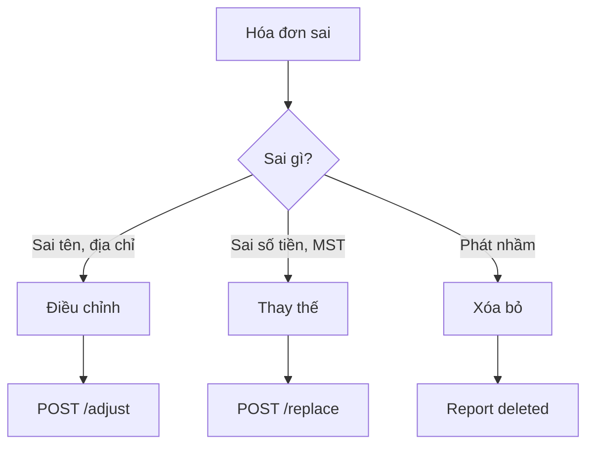

# Phân tích JTBD

> 6 Jobs-To-Be-Done chính mà merchant "thuê" Haravan Invoice để hoàn thành, từ phát hành hóa đơn nhanh đến phân tích doanh thu.

:::tip Tóm tắt
Phương pháp JTBD giúp hiểu rõ merchant không chỉ "cần hóa đơn" mà đang "thuê" hệ thống để giải quyết các công việc cụ thể: tuân thủ pháp lý, quản lý rủi ro, và tối ưu doanh thu.
:::

## JTBD 1: Phát hành hóa đơn nhanh cho khách

**Job Statement:**
> "Khi khách yêu cầu hóa đơn tại quầy, tôi muốn phát hành trong 1 click để khách không phải chờ đợi."

| Thuộc tính | Chi tiết |
|---|---|
| **Context** | Khách thanh toán tại POS, cần HĐ ngay |
| **Motivation** | Phục vụ khách nhanh, tránh xếp hàng |
| **Success metric** | Thời gian phát hành < 3 giây |
| **Persona** | [Chị Mai — F&B](./personas.md) |

### Giải pháp hiện tại

- [Phát hành 1-click](../api/one-click.md) — POST /api/v1/invoices/one-click
- Auto-issue khi đơn paid — [Settings Automation](../sop/settings-automation.md)

### Competing solutions

| Giải pháp | Ưu điểm | Nhược điểm |
|---|---|---|
| Haravan Invoice 1-click | 1 click trong POS | Cần setup trước |
| T-VAN truyền thống | Đầy đủ tính năng | 5-10 bước, chậm |
| Không phát hành | Tiết kiệm thời gian | Vi phạm NĐ 70 |

---

## JTBD 2: Tuân thủ NĐ 70/2025 về gộp hóa đơn

**Job Statement:**
> "Cuối mỗi ngày, tôi cần gộp các hóa đơn lẻ từ POS/Web để gửi cơ quan thuế, tránh bị phạt."

| Thuộc tính | Chi tiết |
|---|---|
| **Context** | HKD có doanh thu ≥1 tỷ/năm, bán lẻ nhiều bill nhỏ |
| **Motivation** | Tuân thủ pháp lý, tránh phạt |
| **Success metric** | 100% bill lẻ được gộp đúng hạn |
| **Persona** | [Chị Mai](./personas.md), [Chị Linh](./personas.md) |

### Giải pháp hiện tại

- [Gộp đơn lẻ cuối ngày](../sop/daily-aggregate.md) — Aggregate page
- API aggregate — GET /api/v1/aggregate
- Tự động đếm SL, tổng tiền theo ngày

### Compliance requirements

| Yêu cầu | Giải pháp |
|---|---|
| HKD ≥1B doanh thu | Hệ thống cảnh báo |
| Bắt buộc máy tính tiền | POS tích hợp |
| Gộp bill cuối ngày | Aggregate page + report |

---

## JTBD 3: Xử lý sai sót hóa đơn

**Job Statement:**
> "Khi phát hiện hóa đơn sai, tôi cần biết chính xác phải điều chỉnh hay thay thế, và thực hiện đúng quy định."

| Thuộc tính | Chi tiết |
|---|---|
| **Context** | Hóa đơn đã phát hành nhưng sai thông tin |
| **Motivation** | Sửa đúng quy định NĐ 70, tránh phạt |
| **Success metric** | Xử lý đúng loại sai sót, không bị CQT từ chối |
| **Persona** | [Anh Tuấn — Kế toán](./personas.md) |

### Giải pháp hiện tại

- [Wizard xử lý sai sót](../sop/correct-invoice.md) — Hướng dẫn từng bước
- Replace endpoint — POST /api/v1/invoices/:id/replace
- Adjust endpoint — POST /api/v1/invoices/:id/adjust

### Decision tree

*Hình 1: Decision tree xử lý sai sót*

---

## JTBD 4: Báo cáo thuế đúng hạn

**Job Statement:**
> "Mỗi quý, tôi cần xuất báo cáo sử dụng hóa đơn điện tử để nộp cơ quan thuế, đúng deadline."

| Thuộc tính | Chi tiết |
|---|---|
| **Context** | Deadline báo cáo quý sắp đến |
| **Motivation** | Nộp báo cáo đúng hạn, tránh phạt |
| **Success metric** | Báo cáo chính xác, export được |
| **Persona** | [Anh Tuấn — Kế toán](./personas.md) |

### Giải pháp hiện tại

- [Báo cáo quý](../sop/reports.md) — Reports/quarterly
- Bảng kê hàng tháng — Reports/ledger
- Chi tiết bán hàng — Reports/sales
- Báo cáo HĐ xóa/sửa/thay thế

---

## JTBD 5: Phân tích doanh thu đa kênh

**Job Statement:**
> "Tôi muốn biết kênh nào (POS, Web, Admin) đang mang lại nhiều doanh thu nhất, và khách hàng/sản phẩm nào top đầu."

| Thuộc tính | Chi tiết |
|---|---|
| **Context** | Quản lý chuỗi cửa hàng, cần insight |
| **Motivation** | Ra quyết định kinh doanh dựa trên data |
| **Success metric** | Hiểu rõ channel mix, top performers |
| **Persona** | [Chị Linh — Manager](./personas.md) |

### Giải pháp hiện tại

- [Analytics page](../sop/analytics.md) — KPI cards, donut chart
- Channel breakdown — GET /api/v1/analytics/channels
- Top customers — GET /api/v1/analytics/top-customers
- Top SKUs — GET /api/v1/analytics/top-skus

---

## JTBD 6: Tự động hóa quy trình hóa đơn

**Job Statement:**
> "Tôi muốn tự động phát hành hóa đơn khi đơn hàng paid, và nhận thông báo khi có sự cố."

| Thuộc tính | Chi tiết |
|---|---|
| **Context** | Volume hóa đơn lớn, không muốn thao tác thủ công |
| **Motivation** | Giảm thao tác manual, không bỏ sót HĐ |
| **Success metric** | 90%+ HĐ tự động phát hành |
| **Persona** | [Chị Linh](./personas.md), [Bạn Nam](./personas.md) |

### Giải pháp hiện tại

- [Settings Automation](../sop/settings-automation.md) — Auto-issue toggle
- Channel selection — WEB, POS, ADMIN
- Delay minutes — configurable 0-60
- Notification toggles — success/error

---

## Outcome Metrics

| JTBD | Metric | Target |
|---|---|---|
| Phát hành nhanh | Thời gian phát hành | < 3 giây |
| Tuân thủ NĐ 70 | % bill lẻ gộp đúng hạn | 100% |
| Xử lý sai sót | Thời gian xử lý | < 2 phút |
| Báo cáo thuế | Thời gian tạo báo cáo | < 30 giây |
| Phân tích | Số insight actionable | 5+/tháng |
| Tự động hóa | % HĐ tự động | 90%+ |

## Liên kết liên quan

- [Persona người dùng](./personas.md)
- [Bắt đầu nhanh](../sop/getting-started.md)
- [Compliance Center](../sop/compliance.md)
