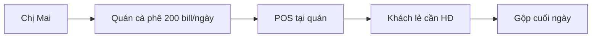
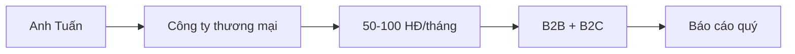
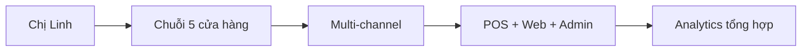
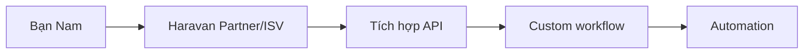

# Persona người dùng

> Phân tích 4 persona chính sử dụng hệ thống Haravan Invoice: chủ shop F&B, kế toán doanh nghiệp nhỏ, quản lý chuỗi cửa hàng, và developer tích hợp.

:::tip Tóm tắt
Haravan Invoice phục vụ 80k+ merchant Haravan với 4 persona chính, mỗi persona có nhu cầu và pain points riêng biệt về hóa đơn điện tử.
:::

## Persona 1: Chị Mai — Chủ quán cà phê F&B

| Thuộc tính | Chi tiết |
|---|---|
| **Tuổi** | 35 |
| **Nghề nghiệp** | Chủ quán cà phê |
| **Quy mô** | 1 cửa hàng, 200 bill/ngày |
| **Kênh bán** | POS tại quán |
| **Doanh thu** | ~500 triệu/tháng |

### Mục tiêu

- Phát hành hóa đơn nhanh cho khách lẻ
- Gộp hóa đơn lẻ cuối ngày theo NĐ 70
- Không cần kiến thức kế toán sâu

### Pain points

- Không rành công nghệ, cần UI đơn giản
- Sợ sai sót khi phát hành hóa đơn
- Không có thời gian quản lý từng bill lẻ

### Kênh sử dụng

- **POS** là chính — tạo hóa đơn 1-click tại quầy
- **Dashboard** — xem tổng quan cuối ngày
- **Aggregate** — gộp bill cuối ngày

### Tính năng quan trọng

1. [Phát hành 1-click](../sop/create-invoice.md) — Tạo HĐ nhanh
2. [Gộp đơn lẻ cuối ngày](../sop/daily-aggregate.md) — Aggregate theo NĐ 70
3. [Dashboard](../sop/dashboard.md) — Tổng quan nhanh

---

## Persona 2: Anh Tuấn — Kế toán doanh nghiệp SMB

| Thuộc tính | Chi tiết |
|---|---|
| **Tuổi** | 28 |
| **Nghề nghiệp** | Kế toán tổng hợp |
| **Quy mô** | Công ty 50 nhân sự |
| **Kênh bán** | Admin + Web |
| **Hóa đơn** | 50-100/tháng |

### Mục tiêu

- Quản lý hóa đơn B2B chính xác
- Báo cáo quý đúng hạn
- Theo dõi công nợ khách hàng

### Pain points

- Nhiều loại thuế suất (0%, 5%, 8%, 10%)
- Cần audit trail khi có tranh chấp
- Thay thế/điều chỉnh hóa đơn sai phức tạp

### Kênh sử dụng

- **Admin** — tạo và quản lý hóa đơn B2B
- **Reports** — báo cáo quý, bảng kê
- [Compliance Center](../sop/compliance.md) — audit trail

### Tính năng quan trọng

1. [Quản lý hóa đơn](../sop/manage-invoices.md) — CRUD đầy đủ
2. [Xử lý sai sót](../sop/correct-invoice.md) — Wizard thay thế/điều chỉnh
3. [Báo cáo](../sop/reports.md) — 6 loại báo cáo
4. [Quản lý khách hàng](../sop/customers.md) — Profile + analytics

---

## Persona 3: Chị Linh — Quản lý chuỗi cửa hàng

| Thuộc tính | Chi tiết |
|---|---|
| **Tuổi** | 32 |
| **Nghề nghiệp** | Operations Manager |
| **Quy mô** | 5 cửa hàng |
| **Kênh bán** | POS + Web + Admin |
| **Hóa đơn** | 1000+/tháng |

### Mục tiêu

- Theo dõi doanh thu đa kênh
- Phân tích top sản phẩm, khách hàng
- Tự động hóa quy trình

### Pain points

- Dữ liệu phân tán nhiều kênh
- Khó tổng hợp báo cáo
- Cần automation để giảm thao tác thủ công

### Kênh sử dụng

- [Analytics](../sop/analytics.md) — Phân tích đa kênh
- [Dashboard](../sop/dashboard.md) — Tổng quan toàn hệ thống
- [Settings Automation](../sop/settings-automation.md) — Auto-issue rules

### Tính năng quan trọng

1. [Phân tích](../sop/analytics.md) — Channel breakdown, top SKU
2. [Tự động hóa](../sop/settings-automation.md) — Auto-issue on paid
3. [Quản lý sản phẩm](../sop/products.md) — Catalog tự động

---

## Persona 4: Bạn Nam — Developer tích hợp

| Thuộc tính | Chi tiết |
|---|---|
| **Tuổi** | 26 |
| **Nghề nghiệp** | Backend Developer |
| **Mục đích** | Tích hợp API hóa đơn |
| **Kênh bán** | API integration |

### Mục tiêu

- Tích hợp API hóa đơn vào hệ thống có sẵn
- Tự động phát hành hóa đơn từ đơn hàng
- Custom workflow theo nghiệp vụ riêng

### Pain points

- API documentation cần rõ ràng
- Cần idempotency để tránh duplicate
- Error handling chi tiết

### Kênh sử dụng

- [API Reference](../api/overview.md) — Endpoint documentation
- [One-Click Issue API](../api/one-click.md) — Auto-issue endpoint
- [Auth API](../api/auth.md) — Authentication

### Tính năng quan trọng

1. [API Invoices](../api/invoices.md) — CRUD endpoints
2. [Idempotency](../api/invoices.md) — `X-Idempotency-Key` header
3. [MST Lookup](../api/mst-lookup.md) — Auto-fill tax code

---

## So sánh Persona

| Tiêu chí | Chị Mai (F&B) | Anh Tuấn (Kế toán) | Chị Linh (Manager) | Bạn Nam (Dev) |
|---|---|---|---|---|
| **Kênh chính** | POS | Admin | Multi | API |
| **SL HĐ/tháng** | 200/ngày | 50-100 | 1000+ | Variable |
| **Kỹ thuật** | Thấp | Trung bình | Trung bình | Cao |
| **Ưu tiên** | Tốc độ | Chính xác | Analytics | Integration |
| **Pain point** | Đơn giản | Compliance | Tổng hợp | API docs |

## Liên kết liên quan

- [Phân tích JTBD](./jtbd.md)
- [Bắt đầu nhanh](../sop/getting-started.md)
- [Dashboard](../sop/dashboard.md)
