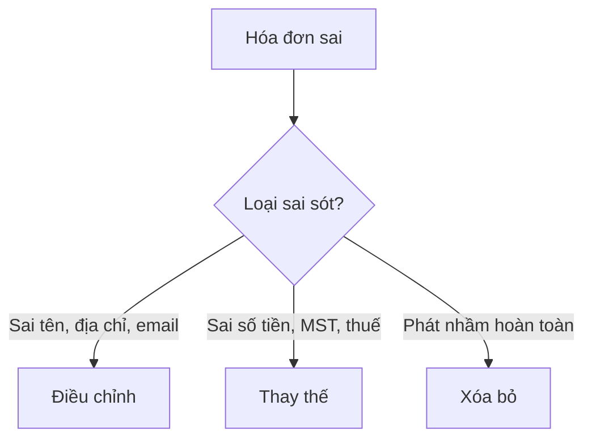

# Xử lý sai sót

> Wizard hướng dẫn xử lý sai sót hóa đơn theo đúng quy định NĐ 70/2025: điều chỉnh hoặc thay thế.

:::tip Tóm tắt
Sai sót hóa đơn có 2 cách xử lý: **Điều chỉnh** (sai tên, địa chỉ) và **Thay thế** (sai số tiền, MST). Wizard giúp chọn đúng phương án và thực hiện từng bước.
:::

## Khi nào dùng gì?

*Hình 1: Decision tree xử lý sai sót*

| Loại sai sót | Hành động | Endpoint |
|---|---|---|
| Sai tên, địa chỉ, email, SĐT | Điều chỉnh | POST /api/v1/invoices/:id/adjust |
| Sai số tiền, MST, thuế suất | Thay thế | POST /api/v1/invoices/:id/replace |
| Phát nhầm hoàn toàn | Xóa bỏ | Báo cáo deleted |

## Bước 1: Chọn hóa đơn cần xử lý

1. Vào **Danh sách hóa đơn**
2. Click vào mã HĐ cần xử lý
3. Click nút **Xử lý sai sót** hoặc **Điều chỉnh/Thay thế**

## Bước 2: Chọn loại xử lý

### Điều chỉnh (Adjustment)

Dùng khi: Sai thông tin không ảnh hưởng đến số tiền.

1. Chọn loại: **Tăng** hoặc **Giảm**
2. Nhập lý do điều chỉnh
3. Chỉnh sửa thông tin cần thay đổi
4. Click **Gửi điều chỉnh**

### Thay thế (Replacement)

Dùng khi: Sai thông tin ảnh hưởng đến số tiền.

1. Nhập lý do thay thế
2. Chỉnh sửa toàn bộ thông tin hóa đơn mới
3. Click **Gửi thay thế**

## Bước 3: Theo dõi trạng thái

| Trạng thái | Ý nghĩa |
|---|---|
| `pending` | Đang gửi T-VAN |
| `cqt_accepted` | CQT đã chấp nhận |
| `cqt_rejected` | CQT từ chối — cần gửi lại |

## Audit trail

Mọi thao tác điều chỉnh/thay thế đều được ghi nhận trong audit trail:

- Thời gian thao tác
- Người thực hiện
- Loại hành động
- Chi tiết thay đổi

Xem tại: [Chi tiết hóa đơn](./manage-invoices.md) → **Audit trail**

## Liên kết liên quan

- [Quản lý hóa đơn](./manage-invoices.md)
- [Compliance Center](./compliance.md)
- [API Invoices](../api/invoices.md)
