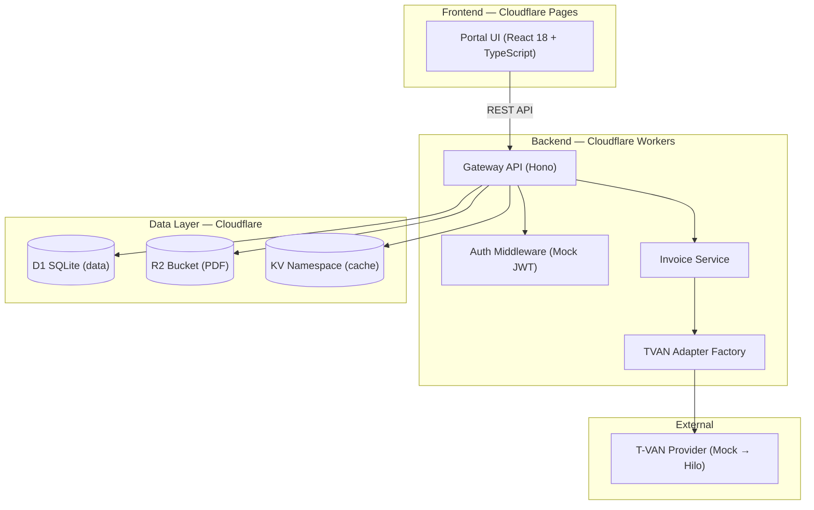
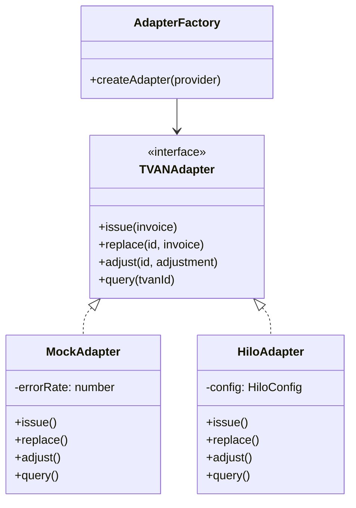
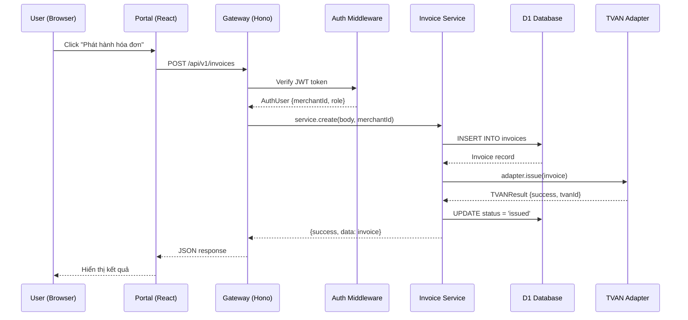

# Tổng quan kiến trúc

> Kiến trúc 3 lớp với Gateway API (Hono + Workers), Portal UI (React + Pages) và Data Layer (D1, R2, KV) trên nền Cloudflare.

:::tip Tóm tắt
Haravan Invoice MVP sử dụng kiến trúc **Gateway + Portal** tách biệt, với **Adapter Pattern** cho TVAN provider, cho phép swap nhà cung cấp T-VAN mà không thay đổi code business logic.
:::

## Kiến trúc tổng thể



*Hình 1: Kiến trúc 3 lớp của Haravan Invoice MVP*

## Lớp 1 — Portal UI (Frontend)

**Vị trí:** `apps/portal/`

| Thuộc tính | Giá trị |
|---|---|
| Framework | React 18 + TypeScript |
| Router | React Router DOM |
| Build | Vite → Cloudflare Pages |
| Styling | CSS custom + Tabler Icons |
| Auth | Mock JWT (localStorage) |

### Cấu trúc thư mục

```
apps/portal/src/
├── App.tsx              # Router config (24 routes)
├── main.tsx             # Entry point
├── components/
│   └── Layout.tsx       # Sidebar + Topbar layout
├── hooks/
│   └── useAuth.ts       # Auth hook
└── pages/               # 24 page components
    ├── Dashboard.tsx
    ├── InvoiceList.tsx
    ├── InvoiceCreate.tsx
    ├── InvoiceDetail.tsx
    ├── InvoiceCorrect.tsx
    ├── CustomerList.tsx
    ├── CustomerDetail.tsx
    ├── ProductList.tsx
    ├── Analytics.tsx
    ├── Notifications.tsx
    ├── Reports.tsx
    ├── ReportSales.tsx
    ├── ReportLedger.tsx
    ├── ReportQuarterly.tsx
    ├── ReportReplaced.tsx
    ├── ReportModified.tsx
    ├── ReportDeleted.tsx
    ├── ComplianceCenter.tsx
    ├── DailyAggregate.tsx
    ├── Settings.tsx
    ├── SettingsTemplates.tsx
    ├── SettingsAutomation.tsx
    ├── SettingsPlan.tsx
    ├── ComingSoon.tsx
    └── Login.tsx
```

### Navigation Structure

Portal có 2 nhóm navigation chính:

**Main Navigation:**
- Tổng quan (Dashboard)
- Thông báo
- Hóa đơn (Tạo, Xử lý sai sót, Danh sách)
- Khách hàng
- Sản phẩm
- Phân tích
- Báo cáo (6 loại báo cáo)

**Configuration Navigation:**
- Thông tin doanh nghiệp
- Chữ ký số
- Mẫu hóa đơn
- Tự động hóa
- Gói dịch vụ

## Lớp 2 — Gateway API (Backend)

**Vị trí:** `apps/api/`

| Thuộc tính | Giá trị |
|---|---|
| Framework | Hono (lightweight web framework) |
| Runtime | Cloudflare Workers |
| Language | TypeScript |
| Auth | Mock JWT middleware |

### Route Structure

```
apps/api/src/
├── index.ts              # App entry, mount routes
├── middleware/
│   └── auth.ts           # JWT auth middleware
├── routes/
│   ├── index.ts          # Route exports
│   ├── auth.ts           # POST /api/v1/auth/login
│   ├── health.ts         # GET /api/v1/health
│   ├── invoices.ts       # CRUD invoices
│   ├── one-click.ts      # POST /api/v1/invoices/one-click
│   ├── customers.ts      # Customer CRUD
│   ├── customer-analytics.ts
│   ├── products.ts       # Product listing
│   ├── reports.ts        # Reports endpoints
│   ├── analytics.ts      # Analytics endpoints
│   ├── settings.ts       # Settings (templates, automation, plan)
│   ├── notifications.ts  # Notifications
│   ├── aggregate.ts      # Daily aggregate
│   ├── mst-lookup.ts     # MST tax code lookup
│   ├── config.ts         # Merchant config
│   ├── audit.ts          # Audit trail
│   └── pdf.ts            # PDF download
├── services/
│   ├── invoice-service.ts
│   └── pdf-service.ts
├── adapters/
│   ├── index.ts
│   ├── factory.ts        # Adapter factory
│   ├── mock-adapter.ts   # Mock TVAN adapter
│   └── types.ts
└── test/
    ├── fixtures.ts
    ├── helpers.ts
    └── test-utils.ts
```

### API Endpoints Summary

| Prefix | Endpoints | Mô tả |
|---|---|---|
| `/api/v1/auth` | POST /login | Mock login → JWT token |
| `/api/v1/health` | GET / | Health check (DB, KV) |
| `/api/v1/invoices` | POST, GET, GET/:id, POST/:id/replace, POST/:id/adjust, POST/:id/one-click | Invoice CRUD + operations |
| `/api/v1/invoices/:id` | GET /pdf, GET /audit | PDF download, audit trail |
| `/api/v1/customers` | GET, GET/:id | Customer list + detail |
| `/api/v1/customers/:id` | GET /analytics | Per-customer analytics |
| `/api/v1/products` | GET | Product catalog (auto-extracted) |
| `/api/v1/reports` | GET /summary, GET /monthly | KPI + monthly reports |
| `/api/v1/analytics` | GET /channels, /top-customers, /top-skus | Analytics data |
| `/api/v1/settings` | GET/PATCH /templates, /automation, GET /plan | Settings management |
| `/api/v1/notifications` | GET, PATCH/:id/read, POST /read-all, GET /unread-count | Notifications |
| `/api/v1/aggregate` | GET | Daily aggregate data |
| `/api/v1/mst` | GET /lookup?mst= | Tax code lookup |
| `/api/v1/config` | GET, PATCH | Merchant config |

## Lớp 3 — Data Layer

### D1 (SQLite Edge Database)

**6 tables:**

| Table | Mô tả | Key columns |
|---|---|---|
| `invoices` | Hóa đơn chính | id, status, buyer/seller, totals |
| `audit_logs` | Nhật ký thao tác | invoice_id, action, actor |
| `merchant_config` | Cấu hình merchant | auto_issue, tax_rate, tvan_provider |
| `idempotency_keys` | Chống duplicate | key, merchant_id, response |
| `customers` | Khách hàng | id, name, mst, email |

**8 indexes** cho query performance: status, haravan_id, buyer_mst, issue_date, created_at, audit foreign keys, customer MST.

### R2 (Object Storage)

- Lưu trữ file PDF hóa đơn
- Cache PDF để download nhanh

### KV (Key-Value Store)

- Session management
- Idempotency keys (TTL 24h)
- Cache dữ liệu

## Adapter Pattern — TVAN Provider Abstraction



*Hình 2: Adapter Pattern cho TVAN Provider*

**Lợi ích:**
- Zero code change khi swap provider
- MockAdapter cho development/testing (5% error rate simulation)
- Interface `TVANAdapter` định nghĩa trong `@haravan/shared`
- Factory pattern tại `apps/api/src/adapters/factory.ts`

## Shared Package

**Vị trí:** `packages/shared/`

| File | Nội dung |
|---|---|
| `invoice.ts` | Types: Invoice, Party, LineItem, InvoiceStatus, Channel, TaxRate |
| `adapter.ts` | Interface: TVANAdapter, TVANResult |
| `api.ts` | Types: ApiResponse, PaginatedResponse, HealthCheckResponse |
| `validation.ts` | validateMST, validateTaxRate, amountToWords, validateInvoice |
| `config.ts` | Constants: STATUS_LABELS, STATUS_COLORS, CHANNEL_LABELS |

## Luồng request điển hình



*Hình 3: Luồng request phát hành hóa đơn*

## Security

| Lớp | Cơ chế |
|---|---|
| Auth | Bearer JWT token (mock → Haravan SSO) |
| Idempotency | `X-Idempotency-Key` header + KV cache |
| Validation | Shared validation package (MST, tax rate, invoice) |
| CORS | Enabled cho Portal domain |
| Request ID | `hono/request-id` middleware |

## Testing

| Package | Test files | Test cases |
|---|---|---|
| `apps/api` | 14 files | Route tests, adapter tests, service tests |
| `apps/portal` | 14 files | Component render tests |
| `packages/shared` | 1 file | Validation tests |
| **Total** | **29 files** | **98+ tests passing** |

## Liên kết liên quan

- [Cơ sở dữ liệu](./database.md) — Chi tiết schema D1
- [Luồng dữ liệu](./data-flow.md) — Data flow diagrams
- [Triển khai](./deployment.md) — Deploy guide
