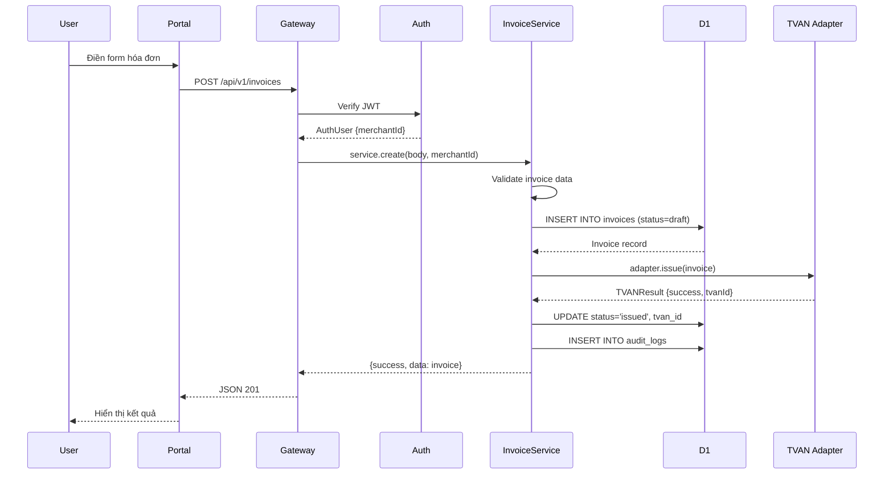
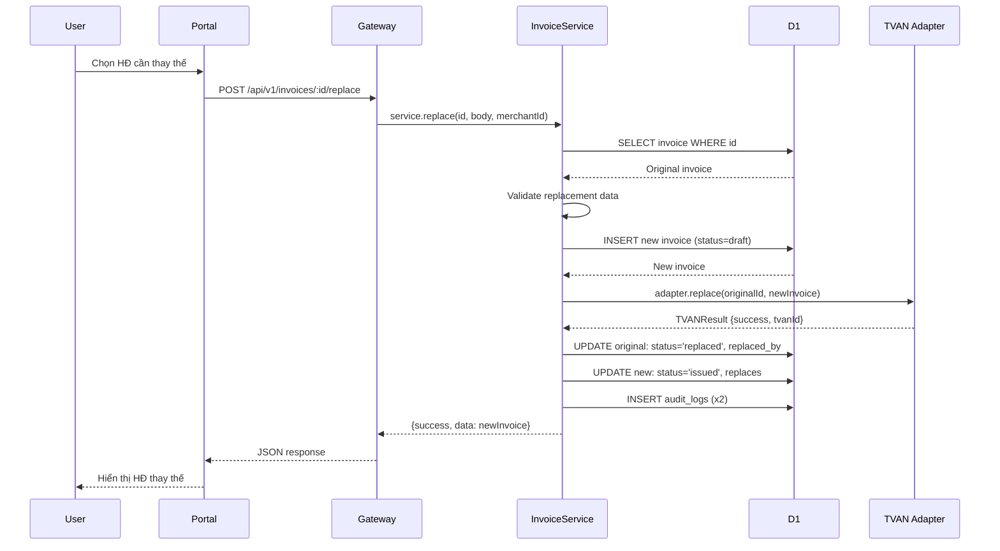
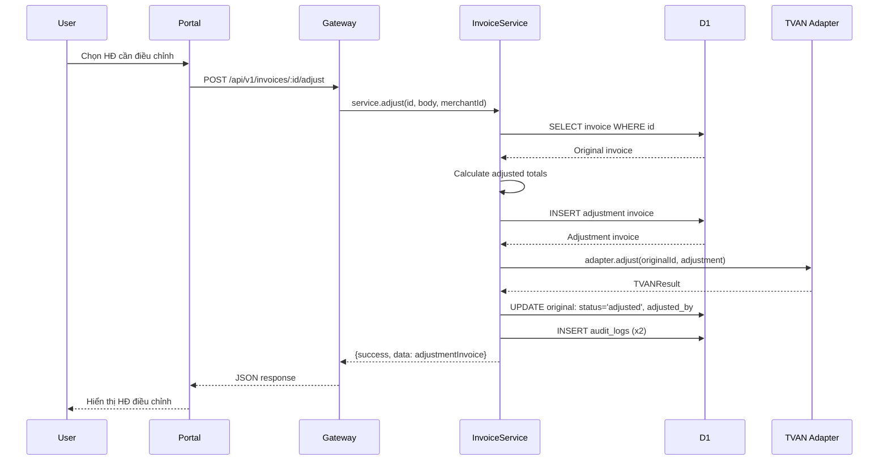
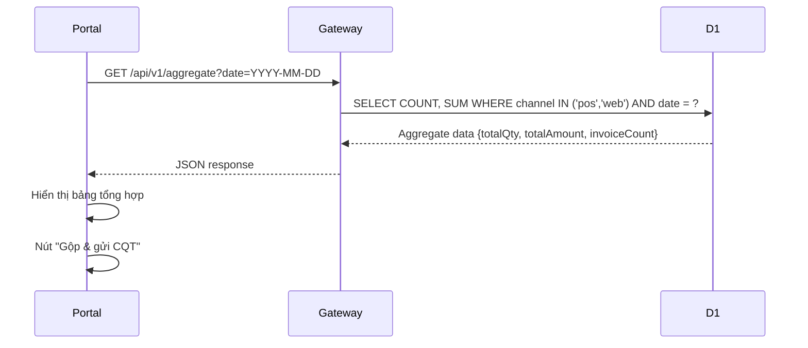
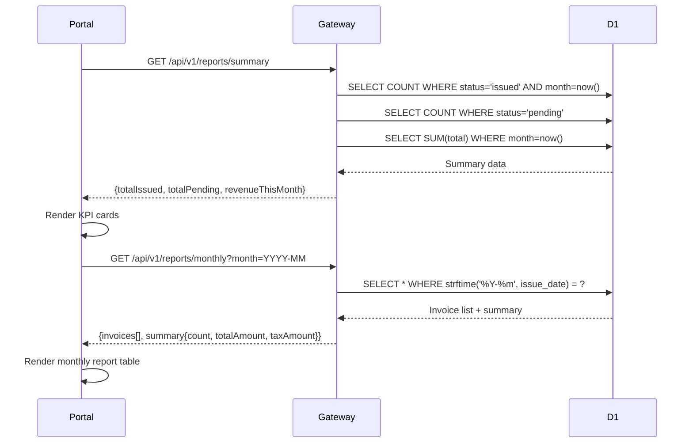
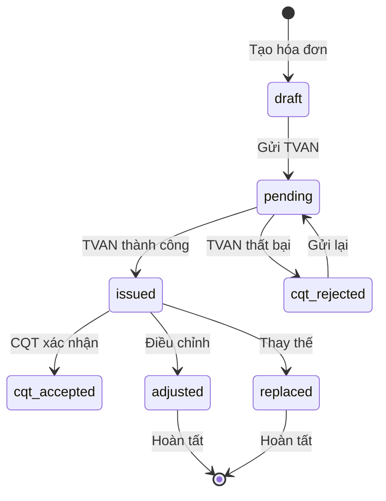

# Luồng dữ liệu

> Sơ đồ luồng dữ liệu chi tiết cho các nghiệp vụ chính: tạo hóa đơn, thay thế, điều chỉnh, báo cáo và aggregate.

:::tip Tóm tắt
Tài liệu này mô tả luồng dữ liệu qua 3 lớp: Portal UI → Gateway API → Data Layer, với 5 luồng nghiệp vụ chính được minh họa bằng sequence diagrams.
:::

## 1. Luồng tạo & phát hành hóa đơn

*Hình 1: Luồng tạo và phát hành hóa đơn*

## 2. Luồng thay thế hóa đơn (NĐ 70/2025)

*Hình 2: Luồng thay thế hóa đơn*

## 3. Luồng điều chỉnh hóa đơn

*Hình 3: Luồng điều chỉnh hóa đơn*

## 4. Luồng gộp hóa đơn cuối ngày (Aggregate)

*Hình 4: Luồng aggregate cuối ngày*

## 5. Luồng báo cáo

*Hình 5: Luồng báo cáo*

## Invoice Lifecycle

*Hình 6: Vòng đời hóa đơn*

## Liên kết liên quan

- [Kiến trúc hệ thống](./architecture.md)
- [Cơ sở dữ liệu](./database.md)
- [API Invoices](../api/invoices.md)
