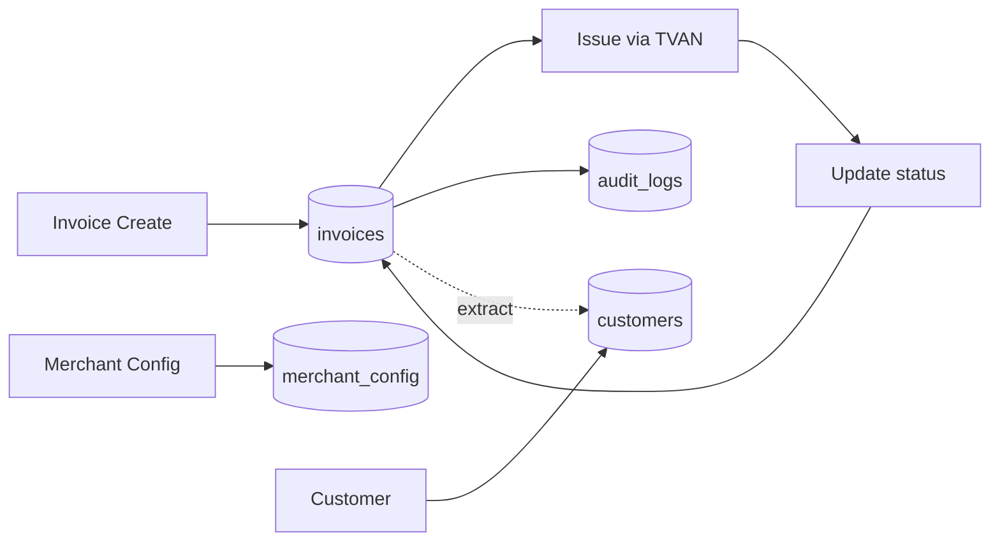

# Cơ sở dữ liệu

> Cơ sở dữ liệu D1 (SQLite edge) với 6 bảng chính, 8 indexes, và quan hệ foreign key cho hệ thống hóa đơn điện tử.

:::tip Tóm tắt
Haravan Invoice sử dụng **Cloudflare D1** — SQLite chạy ở edge — với 6 bảng: `invoices`, `audit_logs`, `merchant_config`, `idempotency_keys`, `customers`. Schema được quản lý qua file `schema.sql` và migrations.
:::

## Tổng quan schema

```mermaid
erDiagram
    invoices {
        TEXT id PK
        TEXT haravan_id UK
        TEXT tvan_id
        TEXT status
        TEXT issue_date
        TEXT buyer_name
        TEXT buyer_mst
        TEXT buyer_email
        TEXT seller_name
        TEXT seller_mst
        TEXT items JSON
        INTEGER subtotal
        INTEGER tax_amount
        INTEGER total
        REAL tax_rate
        TEXT channel
        TEXT created_at
        INTEGER version
    }

    audit_logs {
        TEXT id PK
        TEXT invoice_id FK
        TEXT action
        TEXT actor
        TEXT details JSON
        TEXT created_at
    }

    merchant_config {
        TEXT merchant_id PK
        INTEGER auto_issue_on_paid
        REAL default_tax_rate
        TEXT seller_name
        TEXT seller_mst
        TEXT tvan_provider
        TEXT mau_so
        TEXT ky_hieu
        TEXT created_at
        TEXT updated_at
    }

    idempotency_keys {
        TEXT key PK
        TEXT merchant_id
        TEXT response
        TEXT created_at
        TEXT expires_at
    }

    customers {
        TEXT id PK
        TEXT name
        TEXT mst
        TEXT address
        TEXT email
        TEXT phone
        TEXT created_at
    }

    invoices ||--o{ audit_logs : "has"
    invoices ||--o| invoices : "replaces"
    invoices ||--o| invoices : "adjusts"
```

*Hình 1: Entity Relationship Diagram*

## Bảng: invoices

Bảng chính lưu trữ thông tin hóa đơn điện tử.

| Column | Type | Constraint | Mô tả |
|---|---|---|---|
| `id` | TEXT | PRIMARY KEY | UUID của hóa đơn |
| `haravan_id` | TEXT | UNIQUE NOT NULL | ID từ hệ thống Haravan |
| `tvan_id` | TEXT | | ID từ T-VAN provider |
| `status` | TEXT | NOT NULL DEFAULT 'draft' | Trạng thái hóa đơn |
| `issue_date` | TEXT | | Ngày phát hành (ISO 8601) |
| `buyer_name` | TEXT | NOT NULL DEFAULT '' | Tên người mua |
| `buyer_mst` | TEXT | | Mã số thuế người mua |
| `buyer_address` | TEXT | | Địa chỉ người mua |
| `buyer_email` | TEXT | | Email người mua |
| `buyer_phone` | TEXT | | SĐT người mua |
| `seller_name` | TEXT | NOT NULL DEFAULT '' | Tên người bán |
| `seller_mst` | TEXT | NOT NULL DEFAULT '' | MST người bán |
| `seller_address` | TEXT | | Địa chỉ người bán |
| `seller_email` | TEXT | | Email người bán |
| `items` | TEXT | NOT NULL DEFAULT '[]' | JSON array line items |
| `subtotal` | INTEGER | NOT NULL DEFAULT 0 | Tiền trước thuế (VNĐ) |
| `tax_amount` | INTEGER | NOT NULL DEFAULT 0 | Tiền thuế |
| `discount` | INTEGER | NOT NULL DEFAULT 0 | Giảm giá |
| `total` | INTEGER | NOT NULL DEFAULT 0 | Tổng cộng |
| `tax_rate` | REAL | DEFAULT 0.1 | Thuế suất (0, 0.05, 0.08, 0.1) |
| `payment_method` | TEXT | DEFAULT 'transfer' | Phương thức thanh toán |
| `channel` | TEXT | DEFAULT 'admin' | Kênh bán |
| `order_id` | TEXT | | ID đơn hàng gốc |
| `replaced_by` | TEXT | FK → invoices(id) | HĐ thay thế |
| `replaces` | TEXT | FK → invoices(id) | HĐ bị thay thế |
| `adjusted_by` | TEXT | FK → invoices(id) | HĐ điều chỉnh |
| `adjusts` | TEXT | FK → invoices(id) | HĐ bị điều chỉnh |
| `metadata` | TEXT | DEFAULT '{}' | JSON metadata |
| `created_at` | TEXT | DEFAULT now() | Thời gian tạo |
| `updated_at` | TEXT | DEFAULT now() | Thời gian cập nhật |
| `version` | INTEGER | DEFAULT 1 | Version number |

### Status values

| Status | Mô tả |
|---|---|
| `draft` | Hóa đơn nháp |
| `pending` | Đang chờ xử lý |
| `issued` | Đã phát hành |
| `cqt_accepted` | Cơ quan thuế đã chấp nhận |
| `cqt_rejected` | Cơ quan thuế từ chối |
| `adjusted` | Đã điều chỉnh |
| `replaced` | Đã thay thế |

### Channel values

| Channel | Mô tả |
|---|---|
| `admin` | Tạo từ Haravan Admin |
| `pos` | Tạo từ POS |
| `web` | Tạo từ Website |
| `auto` | Tự động phát hành |

### Payment method values

| Method | Mô tả |
|---|---|
| `cash` | Tiền mặt |
| `transfer` | Chuyển khoản |
| `card` | Thẻ |
| `cod` | Thu hộ |
| `other` | Khác |

## Bảng: audit_logs

Nhật ký thao tác trên hóa đơn, phục vụ compliance và audit trail.

| Column | Type | Constraint | Mô tả |
|---|---|---|---|
| `id` | TEXT | PRIMARY KEY | UUID log entry |
| `invoice_id` | TEXT | NOT NULL, FK | Reference đến invoices |
| `action` | TEXT | NOT NULL | Thao tác (create, issue, replace, adjust) |
| `actor` | TEXT | DEFAULT 'system' | Người thực hiện |
| `details` | TEXT | DEFAULT '{}' | JSON chi tiết |
| `created_at` | TEXT | DEFAULT now() | Thời gian |

## Bảng: merchant_config

Cấu hình riêng cho từng merchant.

| Column | Type | Constraint | Mô tả |
|---|---|---|---|
| `merchant_id` | TEXT | PRIMARY KEY | ID merchant |
| `auto_issue_on_paid` | INTEGER | DEFAULT 0 | Tự động phát hành khi đơn paid |
| `default_tax_rate` | REAL | DEFAULT 0.1 | Thuế suất mặc định |
| `seller_name` | TEXT | | Tên người bán |
| `seller_mst` | TEXT | | MST người bán |
| `seller_address` | TEXT | | Địa chỉ người bán |
| `tvan_provider` | TEXT | DEFAULT 'mock' | TVAN provider (mock/hilo/viettel/misa) |
| `mau_so` | TEXT | DEFAULT '01GTKT0/001' | Mẫu số hóa đơn |
| `ky_hieu` | TEXT | DEFAULT 'AA/20E' | Ký hiệu hóa đơn |
| `created_at` | TEXT | DEFAULT now() | Thời gian tạo |
| `updated_at` | TEXT | DEFAULT now() | Thời gian cập nhật |

## Bảng: idempotency_keys

Chống duplicate request khi retry.

| Column | Type | Constraint | Mô tả |
|---|---|---|---|
| `key` | TEXT | PRIMARY KEY | Idempotency key từ header |
| `merchant_id` | TEXT | NOT NULL | ID merchant |
| `response` | TEXT | | JSON response đã cache |
| `created_at` | TEXT | DEFAULT now() | Thời gian tạo |
| `expires_at` | TEXT | | Thời gian hết hạn |

## Bảng: customers

Danh sách khách hàng mua hàng.

| Column | Type | Constraint | Mô tả |
|---|---|---|---|
| `id` | TEXT | PRIMARY KEY | UUID khách hàng |
| `name` | TEXT | NOT NULL | Tên khách hàng |
| `mst` | TEXT | | Mã số thuế |
| `address` | TEXT | | Địa chỉ |
| `email` | TEXT | | Email |
| `phone` | TEXT | | SĐT |
| `created_at` | TEXT | DEFAULT now() | Thời gian tạo |

## Indexes

| Index | Table | Column(s) | Mục đích |
|---|---|---|---|
| `idx_invoices_status` | invoices | status | Filter theo status |
| `idx_invoices_haravan` | invoices | haravan_id | Lookup by Haravan ID |
| `idx_invoices_buyer_mst` | invoices | buyer_mst | Search theo MST |
| `idx_invoices_issue_date` | invoices | issue_date | Filter theo ngày |
| `idx_invoices_created` | invoices | created_at | Sort theo thời gian |
| `idx_audit_invoice` | audit_logs | invoice_id | Lookup audit by invoice |
| `idx_audit_created` | audit_logs | created_at | Sort audit logs |
| `idx_customers_mst` | customers | mst | Search customer by MST |

## Migrations

Schema được quản lý qua file `schema.sql` tại `apps/api/schema.sql`:

```bash
# Apply migrations
cd apps/api && pnpm db:migrate

# Seed dev data
pnpm db:seed
```

## Data Flow



*Hình 2: Data flow giữa các bảng*

## Liên kết liên quan

- [Kiến trúc hệ thống](./architecture.md)
- [Luồng dữ liệu](./data-flow.md)
- [API Invoices](../api/invoices.md)
