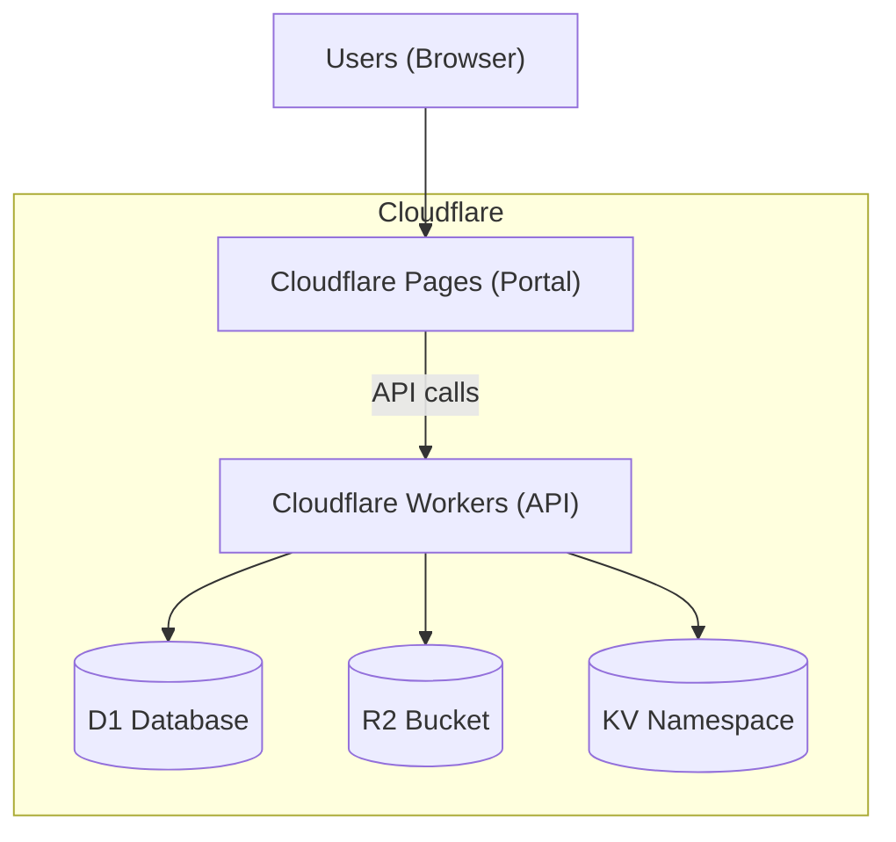

# Triển khai

> Hướng dẫn deploy Haravan Invoice MVP lên Cloudflare Workers (API) và Cloudflare Pages (Portal) sử dụng Wrangler CLI.

:::tip Tóm tắt
Hệ thống deploy trên **Cloudflare free tier**: API chạy trên Workers, Portal chạy trên Pages, database D1, storage R2, cache KV. Quy trình: build → wrangler deploy → verify.
:::

## Yêu cầu

| Yêu cầu | Phiên bản |
|---|---|
| Node.js | >= 18 |
| pnpm | >= 9.0.0 |
| Wrangler CLI | >= 4.14.0 |
| Cloudflare Account | Free tier đủ dùng |

## Cấu trúc deploy



*Hình 1: Cấu trúc deploy trên Cloudflare*

## Bước 1: Setup Cloudflare Resources

### Tạo D1 Database

```bash
# Tạo database
npx wrangler d1 create haravan-invoice-db

# Copy database_id vào wrangler.toml
# [[d1_databases]]
# binding = "DB"
# database_name = "haravan-invoice-db"
# database_id = "your-database-id"
```

### Tạo R2 Bucket

```bash
# Tạo bucket
npx wrangler r2 bucket create haravan-invoice-pdfs

# Cấu hình trong wrangler.toml
# [[r2_buckets]]
# binding = "R2"
# bucket_name = "haravan-invoice-pdfs"
```

### Tạo KV Namespace

```bash
# Tạo namespace
npx wrangler kv:namespace create "KV"

# Copy ID vào wrangler.toml
# [[kv_namespaces]]
# binding = "KV"
# id = "your-kv-namespace-id"
```

## Bước 2: Apply Database Schema

```bash
cd apps/api

# Apply schema
npx wrangler d1 execute haravan-invoice-db --file=schema.sql

# Seed dev data (optional)
npx wrangler d1 execute haravan-invoice-db --file=seed.sql
```

## Bước 3: Deploy API (Workers)

```bash
cd apps/api

# Build (nếu có)
pnpm build

# Deploy
npx wrangler deploy

# Hoặc dùng script
pnpm deploy
```

### Verify API

```bash
# Health check
curl https://your-worker.your-subdomain.workers.dev/api/v1/health

# Expected response
# {"status":"ok","db":"connected","timestamp":"2026-05-16T..."}
```

## Bước 4: Deploy Portal (Pages)

```bash
cd apps/portal

# Build
pnpm build

# Deploy qua Wrangler
npx wrangler pages deploy dist

# Hoặc upload trực tiếp qua Cloudflare Dashboard
# 1. Vào Pages → Create Project
# 2. Upload dist/ folder
```

### Configure API URL

Cấu hình API endpoint trong Portal:

```typescript
// apps/portal/src/config.ts hoặc env
const API_BASE_URL = 'https://your-worker.your-subdomain.workers.dev';
```

## Wrangler Configuration

### API (apps/api/wrangler.toml)

```toml
name = "haravan-invoice-api"
compatibility_date = "2025-04-01"

[[d1_databases]]
binding = "DB"
database_name = "haravan-invoice-db"
database_id = "your-database-id"

[[r2_buckets]]
binding = "R2"
bucket_name = "haravan-invoice-pdfs"

[[kv_namespaces]]
binding = "KV"
id = "your-kv-namespace-id"

[vars]
ENVIRONMENT = "production"
```

### Portal (apps/portal/wrangler.toml)

```toml
name = "haravan-invoice-portal"
compatibility_date = "2025-04-01"

[vars]
API_URL = "https://your-worker.your-subdomain.workers.dev"
```

## Environment Variables

| Variable | Mô tả | Default |
|---|---|---|
| `ENVIRONMENT` | production / development | development |
| `JWT_SECRET` | Secret key cho JWT | (required) |
| `API_URL` | URL của API Worker | http://localhost:8787 |

## CI/CD (GitHub Actions)

```yaml
name: Deploy
on:
  push:
    branches: [main]

jobs:
  deploy-api:
    runs-on: ubuntu-latest
    steps:
      - uses: actions/checkout@v4
      - uses: pnpm/action-setup@v4
      - run: pnpm install
      - run: cd apps/api && npx wrangler deploy
        env:
          CLOUDFLARE_API_TOKEN: ${{ secrets.CF_API_TOKEN }}

  deploy-portal:
    runs-on: ubuntu-latest
    steps:
      - uses: actions/checkout@v4
      - uses: pnpm/action-setup@v4
      - run: pnpm install
      - run: cd apps/portal && pnpm build
      - run: cd apps/portal && npx wrangler pages deploy dist
        env:
          CLOUDFLARE_API_TOKEN: ${{ secrets.CF_API_TOKEN }}
```

## Rollback

```bash
# Rollback Workers
npx wrangler deploy --keep-vars

# Rollback Pages
# Cloudflare Dashboard → Pages → Deployments → Rollback
```

## Monitoring

| Tool | Mô tả |
|---|---|
| Cloudflare Dashboard | Workers analytics, errors, CPU time |
| D1 Dashboard | Query performance, storage usage |
| R2 Dashboard | Storage usage, bandwidth |
| KV Dashboard | Namespace usage |

## Liên kết liên quan

- [Kiến trúc hệ thống](./architecture.md)
- [Cơ sở dữ liệu](./database.md)
- [Bắt đầu nhanh](../sop/getting-started.md)
